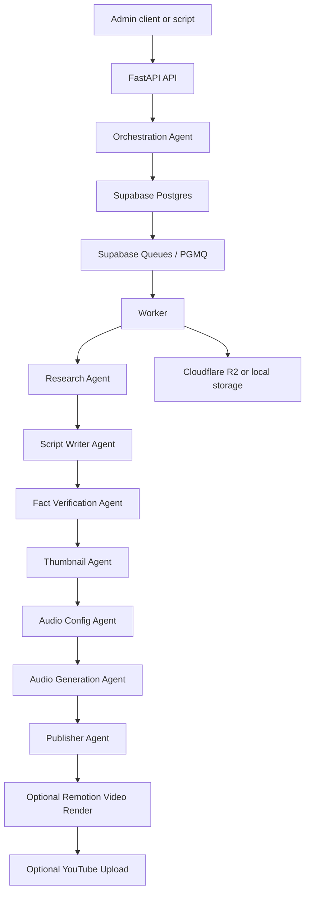

# Pleopod Backend

Pleopod is an open-source backend for generating source-backed podcast episodes
with AI agents. It turns a title into researched notes, a two-speaker script,
fact-checking artifacts, thumbnails, audio, optional video, and optional YouTube
uploads through a durable queue-based pipeline.

The project is built for local experimentation first, but the architecture is
close to production shape: FastAPI for the control plane, SQLite/local files for
local development, Supabase Postgres and Queues plus Cloudflare R2 as production
adapters, Gemini for AI work, and Remotion for optional video rendering.

## What It Does

- Accepts a podcast title and turns it into a normalized generation job.
- Researches the topic with source-aware prompts and structured claim output.
- Writes a conversational two-speaker script for Gemini TTS.
- Runs line-by-line verification before audio generation.
- Generates thumbnails and final podcast audio.
- Stores every important intermediate artifact for debugging and review.
- Optionally renders a branded MP4 video with Remotion.
- Optionally uploads rendered videos to YouTube through the YouTube Data API.
- Supports fake/local mode for low-cost development without calling AI or R2.

## Architecture



FastAPI does not generate podcasts inside the HTTP request. It creates a job,
stores state, and sends a small queue message. The worker then processes durable
pipeline steps one at a time.

Pipeline steps:

```text
research -> script -> fact_check -> thumbnail -> audio_config -> audio_generation -> publish
```

Optional steps:

```text
publish -> video_render -> youtube_upload
```

## Tech Stack

- **Python 3.12+**
- **FastAPI** for API and admin endpoints
- **SQLAlchemy async** for database access
- **SQLite locally** or **Supabase Postgres** for metadata, jobs, artifacts, and episodes
- **SQLite locally** or **Supabase Queues / PGMQ** for durable worker messages
- **Local filesystem storage** or **Cloudflare R2** for generated assets
- **Google Gemini API** for orchestration, research, scripts, verification, Imagen thumbnails, and TTS
- **Remotion** for optional deterministic video rendering
- **YouTube Data API v3** for optional video upload

## Repository Layout

```text
app/
  agents/              Pipeline agents
  api/                 FastAPI routes and dependencies
  core/                Config, JSON parsing, text, security, logging
  db/                  Queue and repository layer
  models/              Enum definitions
  providers/           AI and storage provider implementations
  services/            Artifact and audio helpers
  worker/              Queue runner and pipeline registry
docs/                  Architecture, API, video, and YouTube notes
remotion-renderer/     Optional Node/Remotion video renderer
scripts/               Local helper scripts
supabase/migrations/   Database schema migrations
tests/                 Unit and integration-style tests
youtube-uploader/      Standalone YouTube upload CLI
```

## Prerequisites

- Python 3.12 or newer
- No external database is required for local development.
- A Supabase project or local Supabase stack with Postgres and PGMQ support if
  you want the production adapter.
- Supabase CLI for applying migrations when using Supabase/Postgres.
- Node.js and npm if you want Remotion video rendering
- Gemini API access if you want real AI generation
- Cloudflare R2 credentials if you want production-style object storage
- Google Cloud OAuth credentials if you want YouTube uploads

## Quick Start

Clone the repo and create an environment file:

```bash
cp .env.example .env
```

Edit `.env` with at least:

```env
DATABASE_BACKEND=sqlite
QUEUE_BACKEND=sqlite
DATABASE_URL=sqlite+aiosqlite:///./local-data/pleopod.db
ADMIN_API_KEY=replace-with-a-long-random-secret
AI_PROVIDER=fake
STORAGE_BACKEND=local
LOCAL_STORAGE_PATH=local-artifacts
```

Install Python dependencies:

```bash
python3.12 -m venv .venv
source .venv/bin/activate
pip install -e ".[dev]"
```

For local SQLite mode, tables are created automatically when the API or worker
starts. Apply Supabase migrations only when using the Postgres adapter:

```bash
supabase db push
```

Run the API:

```bash
pleopod-api
```

Run the worker in a second terminal:

```bash
pleopod-worker
```

Create a generation job:

```bash
curl -X POST http://localhost:8000/admin/generation-jobs \
  -H "content-type: application/json" \
  -H "x-admin-api-key: $ADMIN_API_KEY" \
  -d '{
    "title": "What developers need to know about AI agents in 2026",
    "category": "Tech",
    "target_duration_seconds": 300,
    "auto_publish": false
  }'
```

Fetch public episodes:

```bash
curl http://localhost:8000/episodes
```

## Low-Cost Local Mode

For development, start with SQLite, fake AI, SQLite queues, and local artifact
storage:

```env
DATABASE_BACKEND=sqlite
QUEUE_BACKEND=sqlite
DATABASE_URL=sqlite+aiosqlite:///./local-data/pleopod.db
AI_PROVIDER=fake
STORAGE_BACKEND=local
LOCAL_STORAGE_PATH=local-artifacts
ENABLE_VIDEO_RENDERING=false
ENABLE_YOUTUBE_UPLOADING=false
```

This avoids Supabase, R2, external AI, Remotion, and YouTube calls. Use this mode
for backend changes, tests, and debugging individual pipeline steps.

## Environment Variables

Most settings are documented in `.env.example`. The most important groups are:

| Variable | Purpose |
| --- | --- |
| `DATABASE_BACKEND` | `sqlite`, `postgres`, or `auto`. Defaults to local SQLite through `auto`. |
| `QUEUE_BACKEND` | `sqlite`, `pgmq`, or `auto`. Defaults to SQLite for SQLite databases and PGMQ for Postgres. |
| `DATABASE_URL` | SQLite URL for local mode or Supabase Postgres connection string for production mode. |
| `ADMIN_API_KEY` | Shared secret for admin endpoints when not using Supabase admin JWTs. |
| `SUPABASE_URL` | Supabase project URL. |
| `SUPABASE_PUBLISHABLE_KEY` / `SUPABASE_SECRET_KEY` | Modern Supabase API keys. |
| `SUPABASE_JWKS_URL` / `SUPABASE_JWKS_JSON` | JWT verification configuration. |
| `STORAGE_BACKEND` | `local` or `r2`. |
| `R2_*` | Cloudflare R2 credentials and bucket config. |
| `AI_PROVIDER` | `fake` or `gemini`. |
| `GEMINI_API_KEY` | Required when `AI_PROVIDER=gemini`. |
| `MAX_AGENT_ATTEMPTS` | Retry budget for failed queue messages. |
| `QUEUE_VISIBILITY_TIMEOUT_SECONDS` | Visibility timeout for long-running jobs. |
| `ENABLE_VIDEO_RENDERING` | Enables Remotion MP4 generation after publishing. |
| `ENABLE_YOUTUBE_UPLOADING` | Enables YouTube upload after video rendering. |

Keep `.env` and OAuth tokens out of git.

## Cost Controls

AI generation, TTS, image generation, video rendering, storage, and YouTube
retries can cost real money. The safest development defaults are:

```env
DATABASE_BACKEND=sqlite
QUEUE_BACKEND=sqlite
DATABASE_URL=sqlite+aiosqlite:///./local-data/pleopod.db
AI_PROVIDER=fake
STORAGE_BACKEND=local
ENABLE_VIDEO_RENDERING=false
ENABLE_YOUTUBE_UPLOADING=false
MAX_AGENT_ATTEMPTS=1
```

When testing with Gemini, use short jobs:

```json
{
  "title": "A short test episode about AI agents",
  "target_duration_seconds": 120,
  "auto_publish": false
}
```

Do not repeatedly rerun the full pipeline to debug a late-stage failure. Inspect
the failing artifact or step, fix that step, and retry from there.

## Remotion Video Rendering

The optional Remotion renderer lives in `remotion-renderer/`.

Remotion has its own license terms. Before using Remotion in a commercial
production setting, confirm whether your use case needs a Remotion commercial
license.

Install and test it directly:

```bash
cd remotion-renderer
npm install
npm run plan:fallback
npm run render:sample:planned
```

Enable backend video rendering:

```env
ENABLE_VIDEO_RENDERING=true
REMOTION_RENDERER_PATH=remotion-renderer
REMOTION_VIDEO_DIRECTOR_MODEL=gemini-2.5-flash-lite
REMOTION_RENDER_TIMEOUT_SECONDS=1800
```

Gemini can create a structured `video_plan.json`, but Remotion renders the video
deterministically. Without `GEMINI_API_KEY`, the renderer can use a local fallback
plan for development.

See `docs/remotion-video-system.md` and `remotion-renderer/README.md`.

## YouTube Uploads

The optional YouTube uploader lives in `youtube-uploader/` and is intentionally
separate from the backend. It consumes a manifest and local media files, then
uses the YouTube Data API v3.

The YouTube Data API does not support service accounts for normal channel
uploads. Use OAuth user consent for the Google account that owns or manages the
target YouTube channel.

Enable backend upload only after video rendering works:

```env
ENABLE_VIDEO_RENDERING=true
ENABLE_YOUTUBE_UPLOADING=true
YOUTUBE_UPLOADER_PATH=youtube-uploader
YOUTUBE_CLIENT_ID=...
YOUTUBE_CLIENT_SECRET=...
YOUTUBE_REFRESH_TOKEN=...
YOUTUBE_DEFAULT_PRIVACY_STATUS=private
```

OAuth checklist:

- Enable the YouTube Data API v3 in Google Cloud.
- Configure an OAuth consent screen.
- If the app is in testing mode, add the channel owner account as a test user.
- Request the scope `https://www.googleapis.com/auth/youtube.upload`.
- Generate the refresh token with the same client ID and secret configured in the backend.
- Keep `YOUTUBE_DEFAULT_PRIVACY_STATUS=private` until the flow is fully verified.

If using OAuth Playground, enable **Use your own OAuth credentials** and add this
authorized redirect URI to the OAuth client:

```text
https://developers.google.com/oauthplayground
```

For local OAuth CLI flows, localhost redirects are supported. A local YouTube
upload failure that says `SSL: CERTIFICATE_VERIFY_FAILED` is a local Python CA
certificate problem, not a localhost deployment problem.

See `docs/youtube-upload-system.md` and `youtube-uploader/README.md`.

## API

Admin endpoints accept either:

- `x-admin-api-key: <ADMIN_API_KEY>`
- a Supabase access token whose `app_metadata.role` is `admin`

Common endpoints:

```http
POST /admin/generation-jobs
GET  /admin/generation-jobs/{job_id}
POST /admin/generation-jobs/{job_id}/approve-script
POST /admin/generation-jobs/{job_id}/publish

GET /episodes
GET /episodes/{slug}
GET /episodes/{episode_id}/stream-url
```

See `docs/api.md`.

## Testing

Run the test suite:

```bash
PYTHONPATH=. pytest
```

## Running One Stage Locally

Use `pleopod-stage` when you want to perfect one pipeline step without running
the whole worker loop.

List the stage contracts:

```bash
pleopod-stage list
```

Inspect one stage:

```bash
pleopod-stage inspect script
```

Run one stage for an existing job:

```bash
pleopod-stage run script <job-id>
```

By default, this records an agent run and writes the stage outputs, but does not
enqueue the next stage. That makes it safe to iterate on one step at a time.

Useful local iteration examples:

```bash
pleopod-stage run research <job-id>
pleopod-stage run script <job-id>
pleopod-stage run fact_check <job-id>
pleopod-stage run audio_config <job-id>
pleopod-stage run audio_generation <job-id> --force
pleopod-stage run video_render <job-id> --force
pleopod-stage run youtube_upload <job-id> --dry-run-upload
```

When a stage is good and you want the normal pipeline to continue:

```bash
pleopod-stage run script <job-id> --enqueue-next
```

Run a focused slice:

```bash
PYTHONPATH=. pytest tests/test_worker_runner.py tests/test_youtube_upload.py
```

Run linting when `ruff` is installed:

```bash
ruff check app tests
```

## Docker

Build and run API plus worker:

```bash
docker compose up --build
```

The compose file mounts `./local-artifacts` for local storage. Production
deployments should run API and worker as separate services with managed Postgres,
R2-compatible storage, and appropriate secret management.

## Troubleshooting

### `ModuleNotFoundError: No module named 'app'`

Run tests with the repository root on `PYTHONPATH`:

```bash
PYTHONPATH=. pytest
```

### Supabase password breaks `DATABASE_URL`

Percent-encode special characters in the password, especially `/`, `%`, `@`, `:`,
`#`, and `?`.

### Queue visibility timeout warnings

Long video renders or uploads can exceed normal database or queue timing
assumptions. Increase `QUEUE_VISIBILITY_TIMEOUT_SECONDS`, keep workers healthy,
and avoid interrupting workers mid-step unless you are prepared for a retry.

### YouTube `redirect_uri_mismatch`

The redirect URI used during OAuth must be listed on the exact OAuth client that
generated the client ID and secret. OAuth Playground normally needs:

```text
https://developers.google.com/oauthplayground
```

### YouTube `SSL: CERTIFICATE_VERIFY_FAILED`

This means the local Python process cannot verify Google's HTTPS certificate.
On macOS with python.org Python, run the Python certificate installer, or set the
worker/uploader environment to use a valid CA bundle such as `certifi`.

### Generated content sounds factual but may be wrong

Keep `REQUIRE_HUMAN_APPROVAL=true` for serious use until you trust your prompts,
models, verification thresholds, and review process.

## Security Notes

- Never commit `.env`, refresh tokens, Supabase secrets, R2 keys, or admin keys.
- Treat generated research and draft scripts as private artifacts by default.
- Use private YouTube uploads during development.
- Use separate credentials for development and production.
- Rotate OAuth refresh tokens and API keys if they appear in logs or screenshots.

## Roadmap Ideas

- Better retry controls for expensive late-stage steps.
- Resume/retry individual pipeline stages from existing artifacts.
- Per-job cost estimates and budget limits.
- Stronger source quality scoring and citation UX.
- Better YouTube OAuth helper flow for local development.
- Dedicated video/uploader worker process.
- OpenTelemetry traces for agent runs and queue messages.

## Contributing

Contributions are welcome. Good first contributions include:

- clearer setup docs
- tests around pipeline edge cases
- local fake provider improvements
- prompt hardening
- queue retry behavior improvements
- YouTube and Remotion developer-experience fixes

Before opening a pull request:

```bash
PYTHONPATH=. pytest
ruff check app tests
```

If `ruff` is not installed, install the development extras:

```bash
pip install -e ".[dev]"
```

## License

No license file is included yet. Before publishing this repository as open
source, add a license such as MIT, Apache-2.0, or AGPL-3.0 depending on how you
want others to use and redistribute the project.
