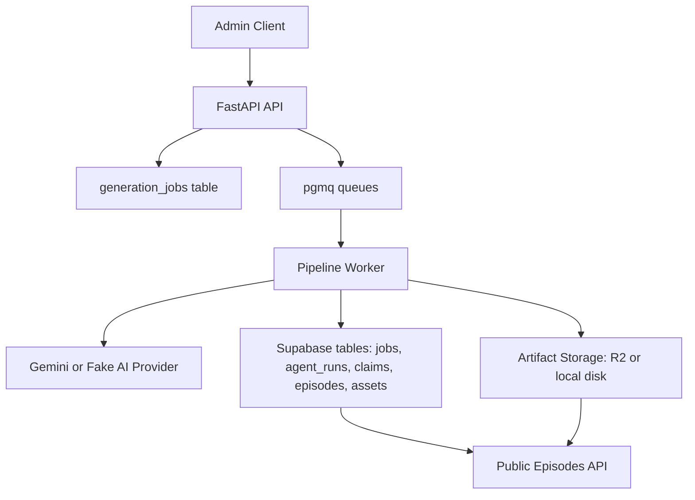

# Pleopod Backend Report

Reviewed on April 24, 2026.

## Executive Summary

This repository is a Python 3.12 backend for an AI-assisted podcast production system called Pleopod. It is built as a queue-driven backend service, not a real-time request/response content generator. The HTTP API is intentionally thin: it accepts admin job requests, exposes job state, and serves published episode metadata. The heavy work happens in a separate worker process that advances jobs through a fixed pipeline of research, script writing, fact verification, thumbnail generation, text-to-speech preparation, audio generation, and publishing.

Architecturally, this is a modular monolith with a durable workflow engine:

- `FastAPI` is the control plane.
- `Supabase Postgres` is the source of truth for metadata and job state.
- `pgmq` queues inside Postgres provide durable step handoff and retry behavior.
- `Cloudflare R2` or local disk stores large artifacts.
- `Gemini` or a deterministic fake provider powers AI generation.

The codebase is small, direct, and pragmatic. It avoids deep frameworks and uses raw SQL repositories instead of an ORM model layer. The main design goal is traceability: each pipeline step leaves database state and stored artifacts behind so the system can be audited, resumed, retried, and inspected.

## What This Backend Is

At the product level, the backend generates podcast episodes from a user title or legacy topic prompt. It is designed for factual technology content, not free-form creative generation.

The backend is responsible for:

- Accepting podcast generation jobs from an admin-facing client.
- Persisting job state and artifacts.
- Running the generation pipeline in a background worker.
- Producing research notes, claim banks, scripts, verification reports, thumbnails, and audio.
- Publishing episode metadata and assets for app consumption.
- Enforcing lightweight admin access rules for sensitive endpoints.

The backend is not responsible for:

- Running generation inside the HTTP request lifecycle.
- Streaming live generation updates over websockets.
- Rendering a frontend or admin UI.
- Managing user accounts directly.
- Editing audio beyond simple concatenation and optional WAV-to-MP3 export.

## Architecture In One Sentence

This backend is a queue-driven AI media pipeline built as a FastAPI control plane plus a worker execution plane, with Postgres as the state machine and R2/local storage as the artifact store.

## High-Level Architecture



## Architectural Style

The implementation is best described as a modular monolith with a workflow engine.

Why that label fits:

- The code is one deployable application repository, not a set of microservices.
- Responsibilities are separated into modules: API, worker, agents, providers, repositories, services, and core utilities.
- Long-running work is decoupled from HTTP and moved into a durable background pipeline.
- State transitions are explicit and persisted in Postgres.

This is not an agentic chat system in the runtime sense. The “agents” are fixed production steps with deterministic positions in the pipeline.

## Repository Structure

### Application Code

- `app/main.py`: FastAPI app factory and router registration.
- `app/serve.py`: `uvicorn` entrypoint for the API.
- `app/api/`: route handlers and dependency wiring.
- `app/core/`: config, logging, text helpers, JSON parsing, auth utilities, TTS voice helpers.
- `app/db/`: SQLAlchemy session setup, `pgmq` queue access, raw SQL repositories.
- `app/agents/`: business logic for each pipeline step.
- `app/providers/`: pluggable AI and storage adapters.
- `app/services/`: artifact persistence and audio file manipulation.
- `app/worker/`: queue-to-agent mapping and worker loop.

### Docs and Infra

- `README.md`: product overview and local setup.
- `docs/architecture.md`: intent-level architecture notes.
- `docs/system-flow.md`: narrative step-by-step pipeline doc.
- `docs/api.md`: endpoint summary.
- `supabase/migrations/0001_initial_podcast_pipeline.sql`: database schema and queue setup.
- `Dockerfile`: API/worker image definition.
- `docker-compose.yml`: local two-service setup.

### Verification

- `tests/`: focused unit tests for config, helpers, auth, orchestration, audio config, audio generation skip logic, and worker message-skipping rules.
- `scripts/generate_podcast.py`: local smoke-test helper that submits a title-first job request and polls for completion.

## Runtime Entry Points

There are two main processes.

### API Process

`pleopod-api` maps to `app.serve:main`, which starts `uvicorn` against `app.main:app`.

Behavior:

- Reads settings from environment.
- Enables auto-reload in local mode.
- Creates the FastAPI app.
- Registers `health`, `admin_jobs`, and `episodes` routers.
- Enables permissive CORS only in local mode.

### Worker Process

`pleopod-worker` maps to `app.worker.runner:main`.

Behavior:

- Loads settings.
- Configures logging.
- Creates a `PipelineWorker`.
- Enters an infinite loop that polls each queue in sequence.
- For each message, loads job state, runs the corresponding agent, records the result, and enqueues the next step.

This split is central to the architecture. HTTP stays fast and durable work happens elsewhere.

## Configuration Model

Configuration lives in `app/core/config.py` and is implemented with `pydantic-settings`.

### Major Configuration Areas

- Runtime: `ENVIRONMENT`, `LOG_LEVEL`, `API_HOST`, `API_PORT`, `ADMIN_API_KEY`
- Database/Supabase: `DATABASE_URL`, `SUPABASE_URL`, key variants, JWT settings
- Storage: `STORAGE_BACKEND`, local/temporary storage paths, R2 account and bucket settings
- AI: provider selection, Gemini API key, OpenAI API key, and separate model names for orchestration/research/script/verification/TTS/thumbnail image
- Pipeline behavior: approval gates, retry count, queue visibility timeout, poll interval, export format, TTS generation mode/chunk size
- Scheduled autopublish: Topic Scout model, audience, region, source URL minimum, runtime limit, and lock TTL

### Important Computed Settings

- `async_database_url`: converts sync-style Postgres URLs into `postgresql+asyncpg://...` when needed.
- `r2_endpoint_url`: derives the Cloudflare R2 S3 endpoint from the account id.
- `resolved_supabase_jwks_url`: defaults the JWKS URL from `SUPABASE_URL` unless explicitly set.

### Validation Rules

The settings class contains explicit validation for:

- malformed `DATABASE_URL` values
- accidental `DATABASE_URL=` prefix duplication in `.env`
- missing R2 credentials when `STORAGE_BACKEND=r2`
- missing Gemini key when `AI_PROVIDER=gemini`

This is a practical touch: some misconfiguration cases are caught with clearer messages than the underlying libraries would give.

## Dependency Stack

### Web and Validation

- `fastapi`
- `uvicorn`
- `pydantic`
- `pydantic-settings`

### Database and SQL

- `sqlalchemy[asyncio]`
- `asyncpg`
- `psycopg[binary]`

### External Integrations

- `boto3` for Cloudflare R2 via S3-compatible APIs
- `httpx` for JWKS fetching and the smoke-test script
- `google-genai` for Gemini
- `python-jose` for JWT verification

### Reliability and Serialization

- `tenacity` for Gemini retries
- `orjson` is declared as a dependency but is not directly used in the current code

## API Surface

The API layer is intentionally small.

### Public Endpoints

- `GET /health`
- `GET /episodes`
- `GET /episodes/{slug}`
- `GET /episodes/{episode_id}/stream-url`

These endpoints only expose published episode data.

### Admin Endpoints

- `POST /admin/generation-jobs`
- `GET /admin/generation-jobs`
- `GET /admin/generation-jobs/{job_id}`
- `POST /admin/generation-jobs/{job_id}/cancel`
- `POST /admin/generation-jobs/{job_id}/approve-script`
- `POST /admin/generation-jobs/{job_id}/publish`

The admin API creates jobs, inspects jobs, moves human-gated jobs forward, and triggers manual publish.

### API Design Characteristics

- All business logic lives below the route layer.
- Route handlers are thin and mostly orchestration wrappers.
- The public API is content-facing.
- The admin API is workflow-facing.

## Authentication and Authorization

Admin access is implemented in `app/core/security.py`.

There are three effective access paths:

1. `x-admin-api-key` matches `ADMIN_API_KEY`
2. `Authorization: Bearer ...` with a verified Supabase JWT whose `app_metadata.role` is `admin` or `app_metadata.roles` includes `admin`
3. local-development bypass when `ENVIRONMENT=local` and no admin key is configured

### JWT Verification Strategy

The backend supports:

- JWKS-based verification using the Supabase signing-key endpoint
- optional inline JWKS JSON for self-hosted or offline verification
- legacy shared-secret HS256 verification as a fallback migration path

### Security Observations

Strengths:

- modern JWKS flow is supported
- admin and public surfaces are separated
- local bypass is explicit rather than accidental

Current caveats:

- local development without `ADMIN_API_KEY` intentionally weakens protection for convenience

## Data Layer and Persistence Strategy

The data access layer uses SQLAlchemy only for connection/session management. Query logic is written as raw SQL in repositories. There are no ORM entity classes.

This has several implications:

- SQL behavior is explicit and easy to audit.
- The code stays close to the actual schema.
- There is very little abstraction overhead.
- Schema changes must be kept manually aligned with repository code.

### Database Tables

The migration creates the following core tables.

#### `podcast_topics`

Stores high-level topic categories. Seeded with `Tech`. Publicly readable via RLS. In the current app code, it is not actively queried.

#### `generation_jobs`

The control record for a podcast generation request.

Important columns:

- content inputs: `topic`, `category`, `audience`, `target_duration_seconds`, `language`, `tone`, `source_urls`
- workflow state: `status`, `current_step`, `error`
- extra state: `metadata`, `created_by`
- timestamps

This is the main state machine record.

#### `artifacts`

Stores pointers to generated files and documents.

Important columns:

- `job_id`
- `episode_id`
- `artifact_type`
- `r2_key`
- `mime_type`
- size and checksum
- JSON metadata

This table is how the system tracks stored outputs without putting large blobs into Postgres.

#### `agent_runs`

Audit log for step executions.

Important columns:

- `job_id`
- `agent_name`
- `step`
- `status`
- `model`
- `input_artifact_id`
- `output_artifact_id`
- `usage`
- `error`
- start/completion timestamps

This is the per-step execution history.

#### `sources`

Stores researched sources for a job.

Includes:

- URL, title, publisher, author
- publication and retrieval timestamps
- source tier and credibility score
- notes

#### `claims`

Stores the structured claim bank for a job.

Includes:

- `claim_text`
- `source_urls`
- `verification_status`
- `confidence`
- `notes`
- `used_in_script`

The code currently replaces the full claim set at each knowledge refresh.

#### `episodes`

The publishable app-facing record.

Includes:

- `generation_job_id`
- `title`, `slug`, `category`
- `status` (`draft`, `published`, `archived`)
- `summary`, `description`
- `duration_seconds`
- `language`
- metadata and timestamps

#### `episode_assets`

Stores app-facing assets like audio and thumbnail for an episode.

Includes:

- `episode_id`
- `asset_type`
- `r2_key`
- `public_url`
- MIME, size, checksum, metadata

#### `speakers`

Schema exists for speaker metadata, but current application code does not write to it.

#### `tts_segments`

Tracks segment-level TTS generation progress.

Includes:

- `job_id`
- `segment_index`
- segment fingerprint
- `r2_key`
- duration placeholder
- status and error

This is what enables segment reuse and partial restart behavior.

### Row-Level Security

RLS is enabled on all tables. Public `select` policies exist for:

- published episodes
- assets belonging to published episodes
- podcast topics

Internal services do not use the Supabase REST/RPC layer here; they connect to Postgres directly using `DATABASE_URL`.

## Queue Architecture

Queues are implemented with `pgmq`, not Redis or a third-party broker.

### Queues Created

- `research_queue`
- `script_queue`
- `fact_check_queue`
- `thumbnail_queue`
- `audio_config_queue`
- `audio_generation_queue`
- `publish_queue`
- `video_render_queue`
- `dead_letter_queue`

### Queue Message Shape

Messages are small metadata envelopes, for example:

```json
{
  "job_id": "uuid",
  "step": "research",
  "attempt": 1
}
```

Large content never rides the queue. That content lives in artifacts.

### Queue Processing Model

The worker:

- loops through queues in a fixed order
- reads at most one message from each queue per pass
- starts the matching pipeline agent
- extends the queue visibility timeout while the agent runs
- deletes the message on success
- allows `pgmq.read_ct` to drive retries
- archives the message and sends a dead-letter record once max attempts are exhausted

### Reliability Characteristics

This design gives the project:

- durable queue storage in Postgres
- retry behavior without in-memory job loss
- small, inspectable queue messages
- straightforward dead-letter handling

### Throughput Characteristics

The current worker is conservative:

- one process
- one message per queue per loop
- no in-process parallel step execution
- mostly synchronous external provider calls inside async functions

That is acceptable for an MVP or low-volume system, but it is intentionally not a high-throughput architecture yet.

## Worker Execution Model

The worker implementation in `app/worker/runner.py` is the operational heart of the backend.

### Step Dispatch

`app/worker/pipeline.py` maps each `PipelineStep` to:

- a queue name
- a concrete agent instance

This means the pipeline is hard-coded and ordered, not dynamically composed.

### Job Guarding

Before running a message, the worker:

- loads the job
- skips work for jobs already `canceled`, `completed`, or `failed`
- skips stale queue messages when the job has clearly advanced to another step

This is how duplicate or delayed messages are tolerated.

### Agent Run Tracking

For each step, the worker:

- marks the job `running`
- writes an `agent_runs` row
- calls the agent
- marks the run completed or failed
- updates job state
- enqueues the next step if needed

### Heartbeat / Visibility Extension

Long-running agents can exceed the queue visibility timeout. To prevent message re-delivery during legitimate work, the worker spawns a heartbeat task that periodically calls `pgmq.set_vt`.

This is a solid durability feature and one of the better implementation choices in the repository.

## The Pipeline, Step by Step

The end-to-end flow is deterministic.

### 1. Job Creation

Route: `POST /admin/generation-jobs`

What happens:

- request payload is validated
- a title-first orchestration step derives the normalized job payload
- a `generation_jobs` row is created
- the initial `research_queue` message is sent
- the API returns `202 Accepted`

Important design point: the request only schedules work. It does not run work.

### 1a. Scheduled Autopublish

Command: `pleopod-autopublish`

This is the Railway-cron-friendly path. It does not expose HTTP and does not run
the infinite queue worker. Instead, it:

- acquires an `automation_locks` row named `autopublish`
- asks the Topic Scout Agent for a timely, source-backed topic
- creates a normal `generation_jobs` row with `auto_publish=true`
- runs the existing pipeline stages directly in sequence
- exits after completion, failure, timeout, or lock skip

The Topic Scout Agent is intentionally narrow. It chooses the initial payload and
source URLs; the Research Agent and Fact Verification Agent still handle factual
grounding before publishing.

### 2. Research Agent

File: `app/agents/research.py`

Inputs:

- job topic
- category, audience, language
- optional source URLs from the request

Provider behavior:

- calls `ai.generate_text(...)`
- turns on Google Search grounding
- passes source URLs when available

Outputs:

- `memory.md`
- `research.json`
- `sources.json`
- `claim_bank.json`
- refreshed `sources` table rows
- refreshed `claims` table rows

Special behavior:

- merges Gemini grounding citations into the source list if they were not already present

### 3. Script Writer Agent

File: `app/agents/script_writer.py`

Inputs:

- research memory markdown
- latest claim bank
- job tone/audience/language/duration

Outputs:

- `script_v1.md`
- `script_v1.json`

Validation rules enforced after generation:

- exactly two speakers
- transcript must not be empty
- both speaker labels must appear in the transcript

The backend is deliberately locked to a two-speaker TTS model.

### 5. Fact Verifier Agent

File: `app/agents/fact_verifier.py`

Inputs:

- generated script JSON
- claim bank

Outputs:

- verification markdown report
- `script_verified.json`

Behavior:

- may replace the transcript if the verifier proposes fixes
- embeds the verification payload into the script JSON

If human approval is enabled:

- job status becomes `awaiting_script_approval`
- pipeline pauses again

### 6. Thumbnail Agent

File: `app/agents/thumbnail.py`

Inputs:

- verified script JSON

Outputs:

- thumbnail prompt text artifact
- generated image artifact

This is currently a thin generation step without brand-governance logic beyond prompt instructions.

### 7. Audio Config Agent

File: `app/agents/audio_config.py`

This is one of the more important glue steps because it adapts a generic script into something safe for Gemini multi-speaker TTS.

What it does:

- strips generated TTS preamble/header noise from the transcript
- normalizes voices to supported Gemini prebuilt voices
- defaults to dialogue-aware chunked TTS so longer episodes stay within Gemini output limits
- can still use one full-episode TTS prompt for short episodes when configured
- emits `tts_config.json`

Important safety limits:

- `TTS_GENERATION_MODE=chunked` is the default for reliable longer episodes
- chunked mode caps source chunk size at `min(MAX_TTS_CHUNK_CHARS, 1200)`
- only two speakers are supported

### 8. Audio Generation Agent

File: `app/agents/audio_generation.py`

Inputs:

- `tts_config.json`
- potentially existing `tts_segments`

What it does:

- skips full regeneration if final audio already exists
- rebuilds stale TTS config if the config appears oversized or incompatible
- reuses completed segment audio when possible
- generates missing TTS segment audio
- stores segment WAV files as artifacts
- records `tts_segments`
- stitches PCM into a final WAV
- optionally converts WAV to MP3 using `ffmpeg`
- stores final audio as an artifact

This step has basic resumability because it can reuse completed segment rows.

### 9. Publisher Agent

File: `app/agents/publisher.py`

Inputs:

- verified script
- final audio artifact
- thumbnail artifact
- publish intent from job config or forced publish message

What it does:

- creates or updates an `episodes` row
- creates or updates `episode_assets` for audio and thumbnail
- writes `episode_metadata_json`
- writes `episode_id` into job metadata
- marks the job completed when video rendering is disabled
- enqueues `video_render` when `ENABLE_VIDEO_RENDERING=true`

Publish behavior:

- `auto_publish=false` produces a draft episode
- `auto_publish=true` or force publish produces a published episode

Slug behavior:

- base slug is derived from script slug/title/topic
- final slug appends the first 8 chars of the job id
- this avoids collisions across jobs

### 10. Video Render Agent

File: `app/agents/video_render.py`

Inputs:

- episode metadata artifact
- verified script and transcript
- final audio artifact
- thumbnail artifact

What it does:

- writes `video_payload_json`
- calls the independent `remotion-renderer` director step to write `video_plan_json`
- calls the Remotion render step to create MP4
- stores `video_mp4`
- creates or updates an `episode_assets` row with `asset_type='video'`
- marks the generation job completed

The video is still rendered entirely by Remotion. Gemini 2.5 Flash only acts as a
structured director for scene layout, timing, captions, and on-screen content. If no
Gemini key is configured, the renderer uses a deterministic fallback plan for local
testing.

## Prompting Strategy

Prompts live in `app/agents/prompts.py`.

The prompting philosophy is plain and schema-oriented:

- tell the model exactly which role it is playing
- define factual and format constraints
- request JSON-only output
- embed expected JSON shapes inline

The backend now pairs prompt discipline with typed Pydantic validation for model outputs.
Orchestration, script writing, and verification pass JSON schemas to Gemini when the
configured model supports the requested mode. Research still uses Google Search and URL
context tools; with Gemini 2.5 models that path relies on JSON prompting plus validation,
while Gemini 3 configurations can combine built-in tools with structured output.

## Artifact Strategy

Artifacts are a core concept in this backend.

### Why Artifacts Matter Here

The system avoids pushing full research dossiers, scripts, or audio bytes through:

- API responses
- queue messages
- database rows

Instead it stores them as files and records pointers in the `artifacts` table.

### Artifact Types Used

- `memory_md`
- `research_json`
- `sources_json`
- `claim_bank_json`
- `script_md`
- `script_json`
- `verified_script_json`
- `verification_report_md`
- `thumbnail_prompt`
- `thumbnail_image`
- `tts_config_json`
- `audio_segment`
- `final_audio`
- `episode_metadata_json`
- `video_payload_json`
- `video_plan_json`
- `video_mp4`

### Practical Impact

This gives the backend:

- inspectable intermediate state
- replay/debug value
- separation between metadata and large blobs
- easier future admin tooling

## Storage Layer

Storage is abstracted behind `ObjectStorage`.

### Supported Backends

- `LocalObjectStorage`
- `TemporaryObjectStorage`
- `R2ObjectStorage`

### Local Mode

Stores artifacts under `LOCAL_STORAGE_PATH`, defaulting to `local-artifacts/`.

This is useful for:

- offline development
- tests
- debugging artifact contents

### Temporary Mode

Uses the same disk-backed behavior as local storage during generation, rooted at
`TEMPORARY_STORAGE_PATH`. After a successful YouTube upload, the YouTube upload
agent deletes generated job artifacts and episode video/metadata files. It keeps
the lightweight database records and the tiny YouTube upload result receipt.

This is useful for scheduled publisher runs where Railway should not retain large
audio/video/image artifacts after the video is already on YouTube.

### R2 Mode

Uses `boto3` with an S3-compatible endpoint generated from the Cloudflare account id.

Capabilities:

- object writes
- object reads
- presigned URLs
- public URL passthrough when `R2_PUBLIC_BASE_URL` is configured

### Design Observation

The code treats the storage abstraction as an artifact store, not a media CDN manager. Delivery policy is simple:

- if there is a configured public base URL, return that
- otherwise return a presigned URL

## AI Provider Layer

The AI provider abstraction supports text, image, and TTS generation.

### Fake Provider

`app/providers/fake.py` is a deterministic development/testing provider.

It returns:

- fake research JSON
- fake script JSON
- fake verification JSON
- a 1x1 transparent PNG
- a 1-second synthetic sine-wave audio segment

This is a strong developer-experience choice because it lets the full pipeline run without external services.

### Gemini Provider

`app/providers/gemini.py` supports:

- grounded text generation
- image generation when configured as the thumbnail image provider
- multi-speaker audio generation

Notable implementation details:

- text and image calls retry three times with exponential backoff
- TTS retries more aggressively and can fall back to a second TTS model
- voice names are normalized to Gemini’s supported prebuilt voices
- Google Search and URL context tools are conditionally enabled
- synchronous SDK calls are isolated with `asyncio.to_thread(...)`

### OpenAI Image Provider

`app/providers/openai.py` supports thumbnail-only image generation through GPT Image.
The thumbnail agent can use this provider without changing the Gemini-backed
research, scripting, verification, or TTS stages.

### Important Runtime Note

The Google GenAI SDK calls used here are synchronous. The provider wraps those calls in
`asyncio.to_thread(...)` so long Gemini requests do not block the worker event loop or
queue heartbeat task. The worker still processes pipeline messages conservatively, but
the provider no longer blocks unrelated async housekeeping inside the process.

## Text and Audio Utility Layer

### Text Utilities

`app/core/text.py` provides:

- slug generation
- dialogue-aware transcript chunking
- sentence and word fallback splitting for oversized turns

This is an important utility because TTS chunking is one of the real operational constraints of the system.

### JSON Utilities

`app/core/json_utils.py` provides:

- tolerant JSON extraction from model output
- pretty-print JSON with support for UUID, datetime, decimal, enum

This is used heavily because model output is expected to be JSON but may arrive wrapped in fences.

### Audio Utilities

`app/services/audio.py` provides:

- PCM-to-WAV wrapping
- WAV decoding back into PCM
- segment stitching
- optional MP3 export through `ffmpeg`

The audio layer is intentionally minimal. There is no normalization, leveling, silence trimming, or multi-track editing.

## End-to-End Request Lifecycle

Here is the actual lifecycle from title to playable episode.

1. Admin client sends `POST /admin/generation-jobs`.
2. API validates the request and accepts either `title` or legacy `topic`.
3. API runs the orchestration agent with `gemini-2.5-flash-lite`.
4. API inserts a `generation_jobs` row using the normalized payload.
5. API sends a `research_queue` message.
6. Worker reads the queue and runs `ResearchAgent`.
7. Artifacts and knowledge rows are written.
8. Worker enqueues `script`.
9. Worker runs `ScriptWriterAgent`.
10. Worker enqueues `fact_check`.
11. Worker runs `FactVerifierAgent`.
12. If approval is required, the job pauses.
13. Otherwise the worker enqueues `thumbnail`.
14. Worker runs `ThumbnailAgent`.
15. Worker enqueues `audio_config`.
16. Worker runs `AudioConfigAgent`.
17. Worker enqueues `audio_generation`.
18. Worker runs `AudioGenerationAgent`.
19. Worker enqueues `publish`.
20. Worker runs `PublisherAgent`.
21. If video rendering is enabled, worker enqueues `video_render`.
22. Worker runs `VideoRenderAgent`, stores the MP4, and attaches a video asset.
23. Job status becomes `completed`.
24. Public clients fetch the episode, assets, and stream URL from the public API.

## How the Public App Consumes the Backend

The app-facing side is simple by design.

### Episode Discovery

`GET /episodes` returns published episodes only.

The repository query orders by:

- `published_at desc nulls last`
- then `created_at desc`

### Episode Detail

`GET /episodes/{slug}` returns a published episode by slug and attaches assets,
including audio, thumbnail, and video assets when video rendering is enabled.

### Audio Access

`GET /episodes/{episode_id}/stream-url` looks up the audio asset.

Behavior:

- if `public_url` exists, return it directly
- otherwise generate a presigned URL with 1-hour expiry

This keeps the mobile app ignorant of job internals and storage implementation details.

## Operational Characteristics

### Local Development

Recommended local fake mode:

- `AI_PROVIDER=fake`
- `STORAGE_BACKEND=local`

That lets a developer run both API and worker without Gemini or R2.

For scheduled production-style publishing jobs, `STORAGE_BACKEND=temporary` keeps
large artifacts on ephemeral disk only until YouTube upload succeeds.

### Docker

The Docker image:

- uses `python:3.12-slim`
- installs `ffmpeg` and `build-essential`
- installs the package from `pyproject.toml`

`docker-compose.yml` runs:

- one API service
- one worker service

Both mount local artifacts into the container.

### Production Assumptions

The codebase assumes production will run:

- API and worker as separate services
- Postgres with `pgmq` enabled
- Gemini configured
- R2 configured
- likely an external admin UI or internal operator workflow

## Testing and Quality Signals

I ran the local test suite in the project virtualenv with:

```bash
PYTHONPATH=. .venv/bin/pytest -q
```

Result:

- `42 passed in 1.91s`

### What The Tests Cover Well

- config validation edge cases
- JSON and text utilities
- TTS transcript normalization and chunk-config safety
- fake provider audio output
- JWT verification via inline JWKS
- admin job creation and operator guard behavior
- worker stale-message skip rules
- audio-generation short-circuit when final audio already exists
- video render payload creation and pipeline registration

### What Is Not Covered Much

- full admin route behavior against a real database
- end-to-end pipeline integration
- real database interaction against a live Postgres/`pgmq`
- R2 integration
- Gemini integration
- publish behavior
- approval-gate behavior
- queue retry/dead-letter behavior

So the unit-level signal is decent, but production flow still depends heavily on integration correctness.

## Strengths of the Current Design

### 1. Durable, Inspectable Workflow

The biggest strength is the durable pipeline shape. Jobs, agent runs, artifacts, and queue messages all leave evidence behind.

### 2. Clean Separation of Concerns

The codebase is divided into sensible layers:

- route layer for HTTP
- repository layer for SQL
- provider layer for external systems
- agent layer for business logic
- worker layer for pipeline execution

### 3. Good Offline Story

The fake AI provider plus local storage mode make the project much easier to develop and debug.

### 4. Practical Human Approval Gates

The approval settings acknowledge that factual AI content generation benefits from operator review.

### 5. Resumable Audio Generation

Tracking TTS segments in the database is a strong design choice and avoids full regeneration in some failure/retry cases.

## Current Gaps, Constraints, and Risks

This section is not a criticism of the idea. It is the realistic shape of the implementation today.

### 1. Single-Worker Throughput

The worker processes one message per queue per loop and does not parallelize within a process. This keeps behavior simple, but throughput is limited.

### 2. Async In Name, Mostly Sync In Practice

The Gemini provider now moves synchronous SDK calls into worker threads, but the overall
worker remains intentionally sequential. This keeps behavior simple, but throughput is
still limited until the worker grows controlled parallelism or horizontal scale.

### 3. Some Schema Elements Are Unused

Examples:

- `speakers` table exists but is not written
- `claims.used_in_script` is not updated from `used_claims`
- `duration_seconds` on episodes is left `None`
- `agent_runs.model` is currently never populated by agents

### 4. Cancel Is Cooperative, Not Immediate

Canceling a job updates the database state, but it does not interrupt an already-running agent call. It mainly prevents future queued work from continuing.

### 5. Tool-Augmented Research Still Needs Runtime Validation

Structured Gemini outputs are used for non-tool calls. Research uses Google Search and
URL context tools, so Gemini 2.5 configurations still depend on JSON prompting followed
by backend validation. Gemini 3 configurations can combine built-in tools with structured
output, but this should be tested before making it the production default.

### 6. Audio Post-Processing Is Minimal

Final audio is stitched and optionally converted, but there is no loudness management, fades, intro/outro composition, or timing metadata.

### 7. No Full Integration Harness In Repo

The pieces are individually reasonable, but the repository does not yet include a true automated end-to-end test against real queue/database/storage components.

## Code-Level Design Patterns Worth Noting

### Repositories Over ORM Models

The project intentionally avoids SQLAlchemy ORM models and uses `text(...)` queries. This is a strong fit for a small backend where schema clarity matters more than abstraction.

### Artifact-First State Management

Instead of passing large documents around in-memory, the system persists each meaningful output and reloads the latest artifact for the next stage.

### Contract-Driven Pipeline

Pipeline steps are defined as enums, then connected through agent contracts.
Each contract declares the queue name, consumed artifacts, produced artifacts,
and graph triggers. This keeps the workflow static and understandable without
requiring each agent to know which agent runs next.

### Pluggable Providers

AI and storage integrations are hidden behind interfaces, which makes local fake mode easy.

## What Happens When Things Fail

Failure handling is mostly worker-driven.

### Agent Failure Path

If an agent raises:

- the worker rolls back the current session
- marks the agent run failed
- updates the job error
- keeps the job queued if retries remain
- marks the job failed once max attempts are exhausted

### Queue Failure Path

Once `pgmq.read_ct` reaches `MAX_AGENT_ATTEMPTS`:

- the original queue message is archived
- a new message is written to `dead_letter_queue`

### Artifact and Resume Behavior

Audio generation has the best resume story because it can reuse segment rows and stored segment audio.

The rest of the pipeline is more step-level durable than operation-level resumable: artifacts remain, but agents generally rerun the full step.

## Practical Mental Model For New Engineers

If someone joins this project, the simplest correct mental model is:

1. The API schedules jobs and exposes data.
2. Postgres stores the workflow truth.
3. `pgmq` moves jobs between steps.
4. Agents are deterministic production stages, not chat agents.
5. Artifacts are the real payloads.
6. The worker is the engine that advances state.
7. The public app only sees finished episodes and their assets.

## Bottom Line

Pleopod’s backend is a thoughtful MVP for durable AI media generation. Its strongest idea is not “use AI to make podcasts.” Its strongest idea is “treat AI generation like a production pipeline with traceable steps, durable state, and stored evidence.”

That makes the system much more credible than a simple prompt-in, audio-out demo.

Today, the codebase is best suited for:

- low to moderate throughput
- operator-aware workflows
- iterative product development
- improving output quality over time through better prompts, approvals, and integrations

To mature further, the most likely next moves would be:

- stronger integration testing
- better concurrency/scaling behavior
- richer publish metadata
- improved observability
- production testing of Gemini 3 structured output with built-in tools
- more complete use of the existing schema

As it stands, the architecture is coherent, the code is readable, the layering is disciplined, and the system already has the bones of a production-grade content pipeline.
