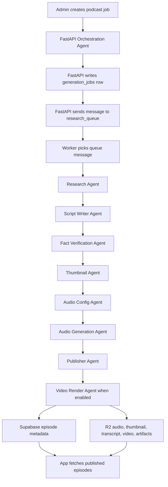

# Pleopod Backend System Flow

This backend has two parts working together:

1. Control plane: FastAPI + Supabase
2. Execution plane: Worker + agents + Cloudflare R2

The control plane receives requests, tracks jobs, exposes APIs, stores metadata,
and controls permissions.

The execution plane does the heavy work: research, script writing, verification,
thumbnail generation, TTS configuration, audio generation, upload, publishing, and
optional Remotion video rendering.

The most important design rule is this:

FastAPI does not generate the podcast directly inside the HTTP request.

FastAPI first orchestrates the requested title into a normalized job payload,
stores the job in Supabase, sends a small queue message, and then the worker
processes that job step by step.



## 1. Job Creation

An admin panel or internal tool calls:

```http
POST /admin/generation-jobs
```

Example body:

```json
{
  "title": "The latest state of AI coding agents",
  "category": "Tech",
  "target_duration_seconds": 600,
  "source_urls": [],
  "auto_publish": false
}
```

FastAPI then:

- validates that the request includes a `title` or legacy `topic`
- calls the orchestration agent to derive the normalized job payload
- applies any explicit request overrides such as category, audience, tone, duration,
  language, and source URLs
- creates a row in `generation_jobs`
- sets the job status to `queued`
- sends a tiny message to `research_queue`

The orchestration agent uses `gemini-2.5-flash-lite`. Its job is to turn a user
title into the structured payload the rest of the pipeline expects. The row stored
in `generation_jobs` still uses the normalized `topic` field consumed by downstream
agents.

The queue message only contains the job identity and next step:

```json
{
  "job_id": "...",
  "step": "research",
  "attempt": 1
}
```

The queue message does not contain the whole podcast, research document, script,
or audio. Large content goes into R2. Supabase stores metadata, state, and pointers
to the artifacts.

## 2. Worker Picks The Job

The worker continuously checks Supabase queues:

- `research_queue`
- `script_queue`
- `fact_check_queue`
- `thumbnail_queue`
- `audio_config_queue`
- `audio_generation_queue`
- `publish_queue`
- `video_render_queue`

When the worker sees a message, it:

- loads the job from Supabase
- marks the job as `running`
- creates an `agent_runs` row
- runs the matching agent
- stores the agent output as an artifact
- sends the next queue message

This gives the system a full audit trail:

- which job is running
- which agent is running
- which step failed
- what artifacts were produced
- how many attempts happened
- where the final files live

## 3. Research Agent

The Research Agent gathers factual information for the normalized podcast topic
saved after orchestration.

In production, this uses Gemini with Google Search grounding and optional URL
context. The goal is to collect recent, authentic, source-backed information
before any script is written.

The Research Agent outputs:

- `memory.md`: human-readable research memory
- `research.json`: structured research dossier
- `sources.json`: source list with credibility metadata
- `claim_bank.json`: atomic factual claims with source URLs

Example R2 paths:

```text
jobs/{job_id}/research/memory.md
jobs/{job_id}/research/research.json
jobs/{job_id}/research/sources.json
jobs/{job_id}/research/claim_bank.json
```

This is the memory layer. Every later agent depends on this researched data.

## 4. Script Writer Agent

The Script Writer Agent reads:

- `memory.md`
- `claim_bank.json`
- job settings such as topic, audience, tone, language, and duration

It writes a two-speaker podcast script.

The script format is strict because Gemini multi-speaker TTS needs stable speaker
names and matching voice configuration.

Example transcript style:

```text
TTS the following conversation between Arman and Maya:

Arman: Welcome back. Today we are unpacking...
Maya: The important thing here is...
```

The agent outputs:

```text
jobs/{job_id}/scripts/script_v1.md
jobs/{job_id}/scripts/script_v1.json
```

The JSON includes:

- title
- slug
- summary
- description
- speakers
- transcript
- used claims

## 5. Fact Verification Agent

The Fact Verification Agent reviews the script line by line.

It reads:

- the generated script
- the researched claim bank

Then it checks:

- is each factual claim supported?
- is anything misleading?
- is the wording too strong?
- does a line need more context?
- should unsupported claims be removed or rewritten?

It outputs:

```text
jobs/{job_id}/verification/report.md
jobs/{job_id}/scripts/script_verified.json
```

If human approval is enabled, the system can pause again at:

```text
awaiting_script_approval
```

An admin then calls:

```http
POST /admin/generation-jobs/{job_id}/approve-script
```

This step prevents the system from turning weak research into polished-sounding
but inaccurate audio.

## 6. Thumbnail Agent

The Thumbnail Agent reads the verified script and generates a thumbnail prompt.

It stores:

```text
jobs/{job_id}/thumbnail/prompt.txt
jobs/{job_id}/thumbnail/cover.png
```

Later this can be upgraded with strict brand rules:

- exact image size
- visual style
- allowed colors
- typography rules
- no fake logos
- no unreadable tiny text

## 7. Audio Config Agent

The Audio Config Agent prepares the verified transcript for TTS.

It decides:

- speaker names
- voice names
- TTS model
- export format
- chunk boundaries

Chunking matters because long TTS generation can become unstable. The backend
splits the transcript into smaller sections before audio generation.

It outputs:

```text
jobs/{job_id}/audio/tts_config.json
```

Example speaker config:

```json
{
  "speakers": [
    { "speaker": "Arman", "voice_name": "Charon" },
    { "speaker": "Maya", "voice_name": "Puck" }
  ]
}
```

## 8. Audio Generation Agent

The Audio Generation Agent reads `tts_config.json`.

For each transcript chunk, it:

- sends the chunk to Gemini TTS
- receives raw audio
- stores the audio segment
- records segment status in `tts_segments`

Example R2 paths:

```text
jobs/{job_id}/audio/segments/001.wav
jobs/{job_id}/audio/segments/002.wav
jobs/{job_id}/audio/final.mp3
```

If `ffmpeg` is available, the system exports MP3. The Dockerfile installs
`ffmpeg`, so production should export MP3 correctly.

## 9. Publisher Agent

The Publisher Agent creates the final episode record in Supabase.

It writes to:

- `episodes`
- `episode_assets`
- `artifacts`

It connects the final episode to:

- final audio
- thumbnail
- metadata
- generation job
- verification report

If `auto_publish=false`, the episode is created as a draft.

If `auto_publish=true`, or if an admin manually calls:

```http
POST /admin/generation-jobs/{job_id}/publish
```

then the episode becomes published.

If `ENABLE_VIDEO_RENDERING=true`, publishing records the episode metadata and then
queues `video_render_queue` instead of completing the generation job immediately.

## 10. Video Render Agent

The Video Render Agent turns the generated podcast into a Remotion-rendered MP4.

It reads:

- published episode metadata
- verified script and transcript
- final audio artifact
- thumbnail artifact

It writes:

```text
jobs/{job_id}/video/video_payload.json
jobs/{job_id}/video/video_plan.json
episodes/{episode_id}/video/final.mp4
```

The agent calls the independent `remotion-renderer/` package. If `GEMINI_API_KEY`
is configured, Gemini 2.5 Flash directs the scene plan. If no Gemini key is present,
the renderer uses a deterministic fallback plan for local testing.

The final MP4 is stored as a `video_mp4` artifact and attached to the episode as an
`episode_assets` row with `asset_type='video'`. The job becomes `completed` after
this step.

## 11. App Fetch Flow

The mobile app does not need to know about the agent pipeline.

It calls public episode endpoints:

```http
GET /episodes
GET /episodes/{slug}
GET /episodes/{episode_id}/stream-url
```

The app receives:

- title
- summary
- description
- thumbnail URL
- audio URL
- duration
- metadata

The actual media file comes from R2, either through a public custom domain or a
signed URL.

## 12. Auth Flow

Admin endpoints support two auth paths.

The first path is a backend admin key:

```http
x-admin-api-key: <ADMIN_API_KEY>
```

The second path is a Supabase user access token with admin metadata.

The backend verifies Supabase JWTs through the modern JWKS signing-key flow.

Default JWKS URL:

```text
{SUPABASE_URL}/auth/v1/.well-known/jwks.json
```

After verifying the token signature, the backend checks:

```json
{
  "app_metadata": {
    "role": "admin"
  }
}
```

The legacy JWT secret is only supported as a migration fallback:

```env
SUPABASE_LEGACY_JWT_SECRET=
```

## Mental Model

The system flow is:

```text
Topic in
  -> researched facts
  -> reviewed facts
  -> script
  -> verified script
  -> thumbnail
  -> TTS config
  -> audio
  -> published episode
  -> app playback
```

Supabase is the source of truth for state.

R2 is the source of truth for large files.

The worker is the engine that moves a job forward.

The agents are not random chatbots. They are controlled production steps with
inputs, outputs, retries, and stored evidence.

That is what makes the system scalable, debuggable, and sellable.
